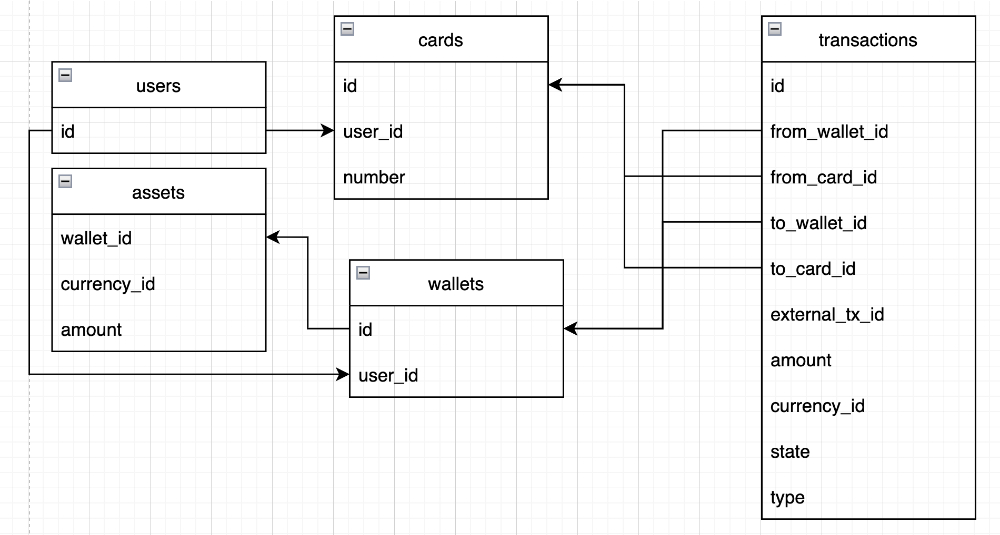
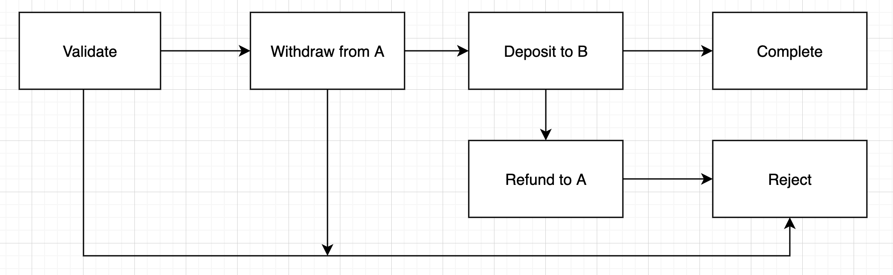
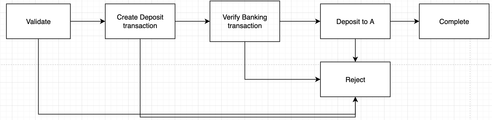
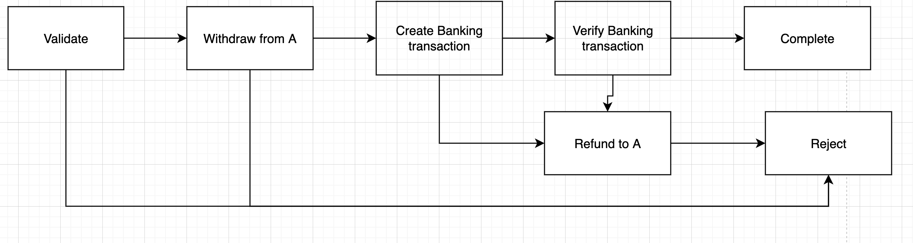

# Wallet app

## Assumption/Scope
Because I don't have much experience with blockchain wallet,
so the scope of wallet app is E-wallet app, where we can deposit/withdraw money from
bank to our app and transfer money between E-wallet users.

## Requirement

Functional requirement:
- User can deposit money into her wallet
- User can withdraw money from her wallet
- User can send money to another user
- User can check her wallet balance

Non-functional requirement:
- only owner of wallets can deposit/withdraw/send money
- keep track all transactions
- if there are any problems within deposit/withdraw/send process, the transaction have to be reversed

## How to run

- You need to install Docker and Docker Compose on your machine
- Start containers

```
$ docker-compose up
```

- Wait a bit for all containers to start up.
- After you see wallet app is running at localhost:8080. You can try out few API endpoint below.

```
$ curl localhost:8080/balance/1
$ curl localhost:8080/balance/2
$ curl --location --max-time 100 --request POST 'http://localhost:8080/transfer' \
  --header 'Content-Type: application/json' \
  --data-raw '{
      "from_wallet_id": 2,
      "to_wallet_id": 1,
      "amount": "10",
      "currency": "USD"
  }'
$ curl --location --max-time 100 --request POST 'http://localhost:8080/deposit' \
  --header 'Content-Type: application/json' \
  --data-raw '{
      "from_card_id": 1,
      "to_wallet_id": 1,
      "amount": "10",
      "currency": "USD"
  }'
$ curl --location --max-time 100 --request POST 'http://localhost:8080/deposit' \
  --header 'Content-Type: application/json' \
  --data-raw '{
      "to_card_id": 1,
      "from_wallet_id": 1,
      "amount": "10",
      "currency": "USD"
  }'
```

-  Here is prepared data 

| user_id | wallet_id | card_id | amount | currency |
| --- | --- | --- | --- | --- |
| 1 | 1 | 1 | 100 | USD
| 2 | 2 | 2 | 200 | USD

## Database Design

#### Choose the database?
- We can see the transactional operation is the important thing we need to have 
in our system to help us control the consistency of our data.
- the format of our data is the list of structured records.

After consideration, I think a relational database is a good option here. So I choose `MySQL` for my Wallet app.

#### Database Design

List of entity and relationship
- User: store user data
- Wallet: store wallet data. Support multiple wallet for a user. 
- Card: store user credit/debit card.
- Transaction: store deposit/withdraw/send money transactions.



Because I want this app to scale up easily when our data grow up. Considering the transaction table will
grow very fast to I want put this table to another database and shard the table, so we can scale up transaction table
horizontally.

Trade off is that we need to handle distributed transaction when we have data in different databases.
To solve that we can apply two phases commit to coordinate distributed transactions.

### Feature design
The main feature of our app is supporting create/update/monitor the state of transaction.
To do that, I design a state machine that control the state of transaction. The advantage of this state machine is that
we can easily add a new state, remove a state and reuse existing state.

We have 3 state machine for 3 scenarios: deposit/withdraw/transfer money

- Transfer money between wallets



- Deposit money from bank to wallet



- Withdraw money from wallet to bank




For each state, state handler will choose which is the next state or retry this state again. For example we have 
connection issue with our database we should retry the state again when database is alive.

## Structure

I follow the domain driven design, so we have a few domains below:
- `modules/wallet`
- `modules/transaction`
- `modules/bank`
- `modules/asset`
- `modules/share`

To start the demo for this library, I have `cmd/demo` to run a simple API server as a proxy of our library. Here is the list of endpoints:

- GET `/balance/{wallet_id}` : get balance of wallet
- POST `/transfer`: transfer money between users. Sample request body below. 
```
{
  "from_wallet_id": 2,
  "to_wallet_id": 1,
  "amount": "10",
  "currency": "USD"
}
```
- POST `/withdraw`: withdraw money from wallet to bank. Sample request body below. 
```
{
  "from_wallet_id": 1,
  "to_card_id": 1,
  "amount": "10",
  "currency": "USD"
}
```
- POST `/deposit`: deposit money from bank to wallet. Sample request body below. 
```
{
  "from_card_id": 1,
  "to_wallet_id": 1,
  "amount": "10",
  "currency": "USD"
}
```

### OO Design
- Single Responsibility: a method a function should only do one things

- Interface Segregation: when a struct use a method of a dependency, I create an interface that
contains only the methods that we use inside that struct. It means that we only use the think we need to use,
we don't import things that we don't use that.

- Dependency injection, only depend on the interface, don't depend on the concrete implementation: it helps us to use 
different instances of the same interface, so we can reuse code and support testing.

### Testing
- Covered by unit test

### Improvement
- Improve test coverage
- Have integration test
- Develop two phases commit coordinator to make sure all the transaction commit or rollback. 
- Have better solution verify third party transaction, for example long pooling
- Store third party transaction history

Finally! Thanks for your time!